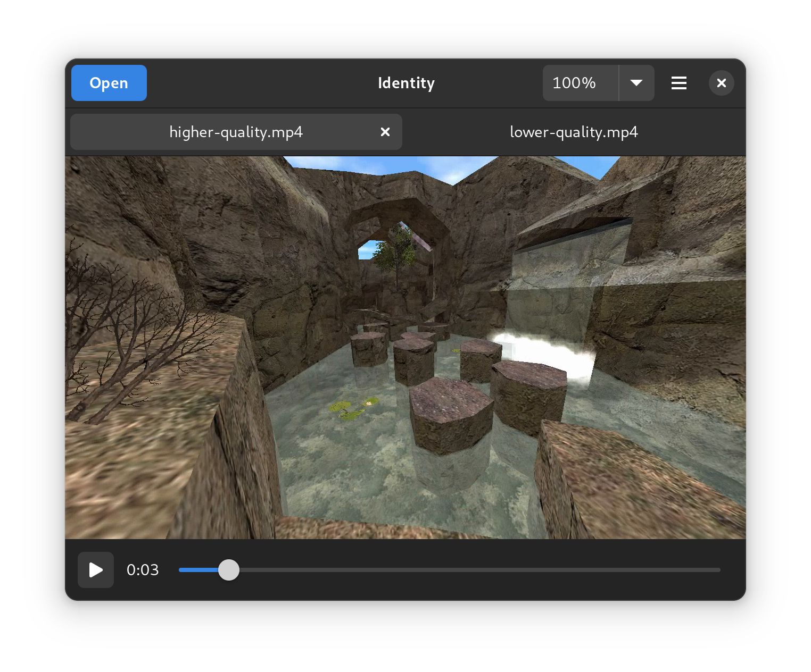

# Identity

A program for comparing multiple versions of an image or video.

<a href='https://flathub.org/apps/details/org.gnome.gitlab.YaLTeR.Identity'></a>



## Format support

Identity uses GStreamer, and therefore your system's or Flatpak GNOME Platform's installed GStreamer plugins. In particular, Identity won't work at all without the `playbin3` element (typically in `gst-plugins-base`) as well as the `gtksink` element (typically in `gst-plugins-good`, although sometimes extracted into its own package).

## Building

The easiest way is to clone the repository with GNOME Builder and press the Build button.

Alternatively, you can build it manually:
```
meson -Dprofile=development -Dprefix=$PWD/install build
ninja -C build install
```
