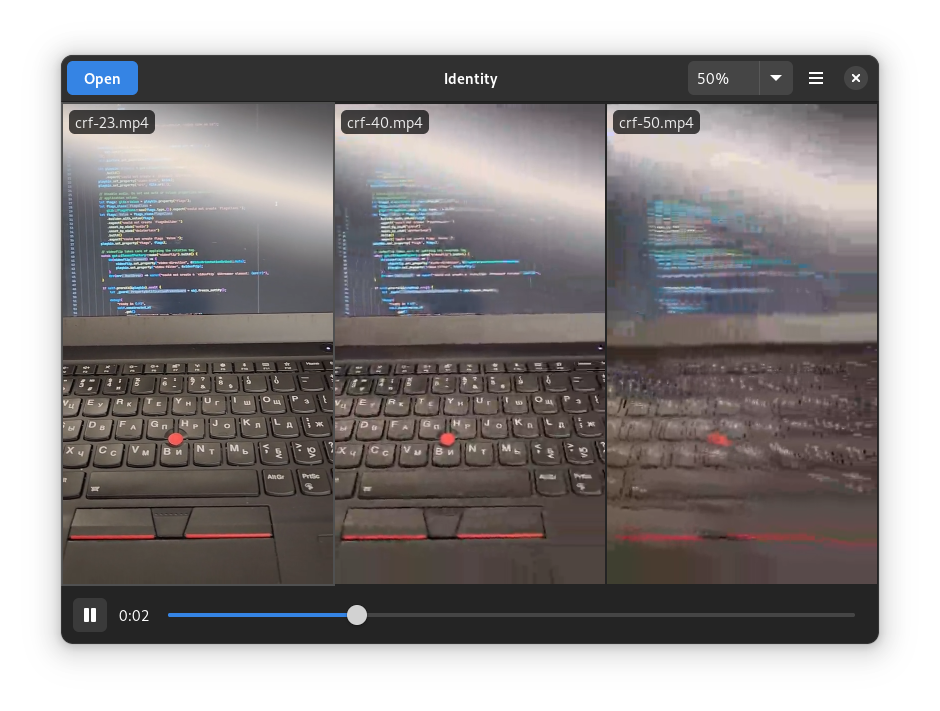

# Identity

A program for comparing multiple versions of an image or video.

<a href='https://flathub.org/apps/details/org.gnome.gitlab.YaLTeR.Identity'></a>



## Running

You can run Identity as is and select files to compare using the Open button. You can also pass file paths or URIs as command-line arguments:

```
$ identity path/to/file1.mp4 path/to/file2.mp4
```

Note that Flatpak Identity doesn't have access to the filesystem, so files need to be forwarded manually like so:

```
$ flatpak run --file-forwarding org.gnome.gitlab.YaLTeR.Identity @@ path/to/file1.mp4 path/to/file2.mp4
```

Use `@@u` instead of `@@` to pass URIs.

## Format support

Identity uses GStreamer, and therefore your system's or Flatpak GNOME Platform's installed GStreamer plugins. In particular, Identity won't work at all without the `playbin3` element (typically in `gst-plugins-base`).

## Contributing translations

You can help translate Identity: https://l10n.gnome.org/module/identity/. Any help is appreciated!

## Building

The easiest way is to clone the repository with GNOME Builder and press the Build button.

Alternatively, you can build it manually:
```
meson -Dprofile=development -Dprefix=$PWD/install build
ninja -C build install
```
